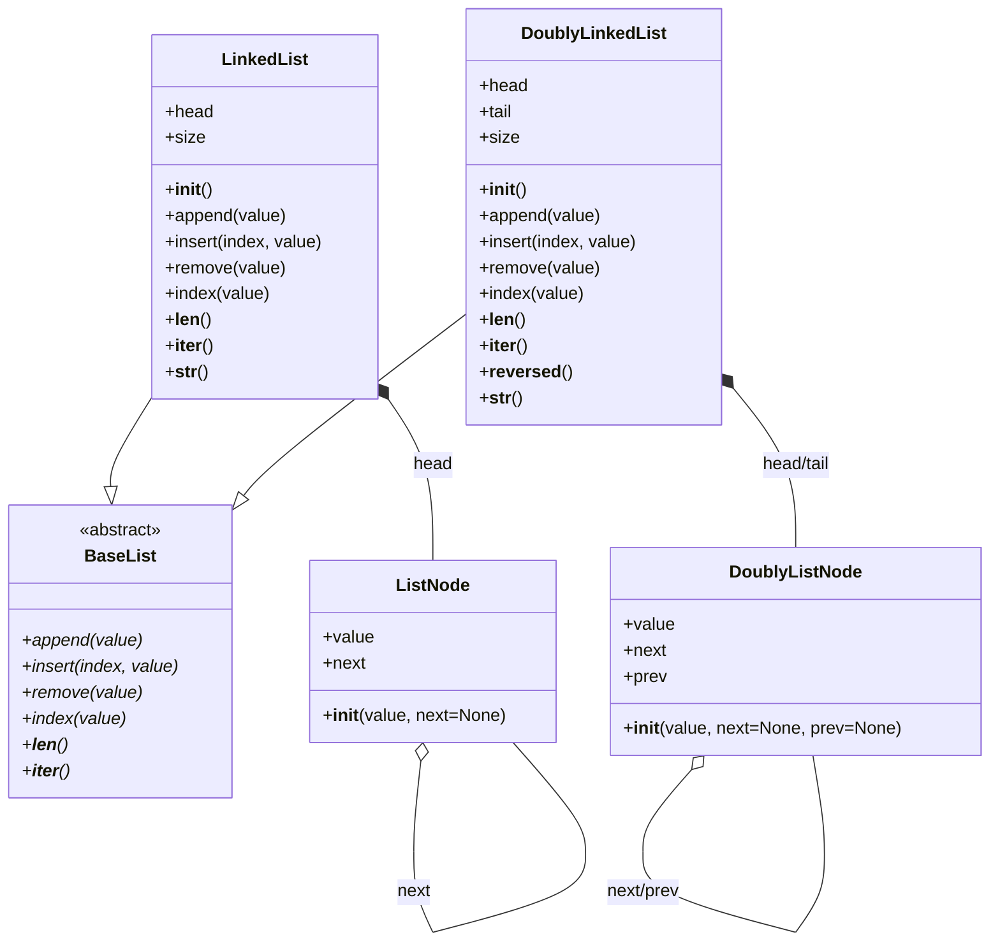

# Структуры данных
  
## Связный список (Linked List)  

**Связный список** — это линейная структура данных, состоящая из узлов, где каждый узел содержит данные и ссылку (указатель) на следующий узел в списке. Основное отличие связного списка от массива заключается в том, что элементы не располагаются в памяти последовательно, а связаны друг с другом ссылками.  

### Основные характеристики:  
- **Динамический размер** — память выделяется по мере добавления элементов.  
- **Эффективное добавление/удаление** элементов в начале списка или в середине (в отличие от массивов, где эти операции могут требовать сдвига элементов).  
- **Последовательный доступ** — доступ к элементам осуществляется путем последовательного прохода по узлам списка.  

### Основные операции:  
1. **Добавление элемента** (в начало, в конец или в определённую позицию).  
2. **Удаление элемента** по значению или индексу.  
3. **Поиск элемента** по значению.  
4. **Получение длины списка**.  
5. **Итерация по элементам списка**.  

## Двусвязный список (Doubly Linked List)  

**Двусвязный список** — это линейная структура данных, состоящая из узлов, где каждый узел хранит не только ссылку на следующий элемент, но и ссылку на предыдущий.  

### Отличия от односвязного списка:  
- Каждый узел содержит **две ссылки**: на следующий и на предыдущий элемент.  
- Позволяет эффективно перемещаться **в обе стороны** (вперёд и назад).  
- Упрощает операции удаления и вставки в середину списка, так как доступен предыдущий элемент.  
- Использует **больше памяти**, чем односвязный список, из-за хранения дополнительной ссылки.  

### Основные операции:  
1. **Добавление элемента** (в начало, конец или по индексу).  
2. **Удаление элемента** по значению или индексу.  
3. **Поиск элемента** по значению.  
4. **Получение длины списка**.  
5. **Итерация по элементам списка** (вперёд и назад).  

## Диаграмма классов  

