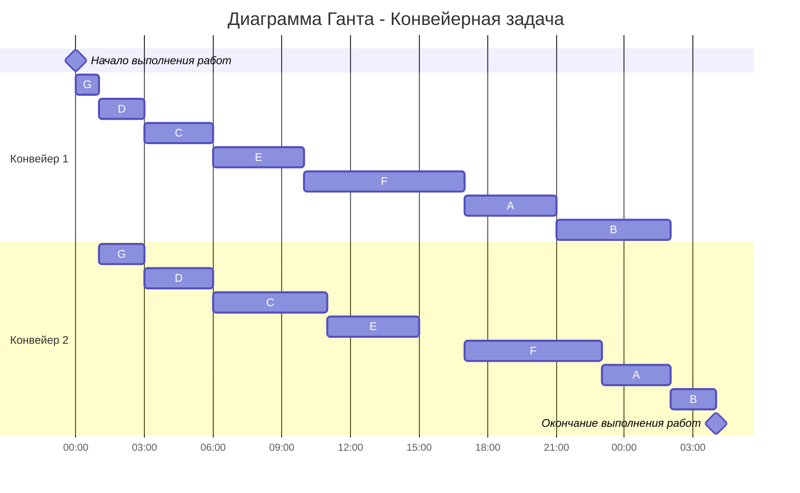

# Задание 9. Варианты 5-9
# Оптимальное расписание. Конвейерная задача
## Задачи  
1.  Конвейерная задача - в файле schedule_pack/conveyor_schedule.py реализовать два приватных метода класса ConveyorSchedule.
    - __sort_tasks(tasks: list[StagedTask]) -> list[StagedTask]: Возвращает отсортированный список задач для применения алгоритма Джонсона.
    - __fill_schedule(self, tasks: list[StagedTask]) -> None: Процедура составляет расписание из элементов ScheduleItem для каждого исполнителя, согласно алгоритму Джонсона.
2. Отдельные задачи для вариантов:
    - Вариант 5. Разработать диаграмму классов пакета schedule_pack с использованием библиотеки (mermaid-js)[https://github.com/mermaid-js/mermaid#class-diagram-docs---live-editor]
    - Вариант 6. Реализовать вывод полученного от класса ConveyorSchedule расписания в формате диаграммы Ганта библиотеки (mermaid-js)[https://github.com/mermaid-js/mermaid#gantt-chart-docs---live-editor]
    - Вариант 7. Добавить новые методы для класса ConveyorSchedule, для вывода времени простоя для каждого исполнителя и общего времени простоя для всего расписания.
    - Вариант 8. Добавить метод для класса ConveyorSchedule, для изменения состава задач и перерасчета расписания.
    - Вариант 9. Добавить отдельные методы для класса ConveyorSchedule, для добавления/удаления задачи и перерасчета расписания.

## Примечания 
- **В файле main.py представлен только пример использования пакета schedules, задание необходимо выполнять в файле schedules/conveyor_schedule.py**.
- Для решения задачи составления оптимального расписания подготовлен python-пакет schedules.
- Python-пакет schedules реализован в объектно-ориентированной парадигме.
- Обратить внимание, что некоторые тесты ожидают вызов определенного вида исключения с заданным сообщением об ошибке.
- В пакете представлены следующие классы
    * Task: Представляет задачу для составления расписания. Используется в качестве входных данных для класса ConveyorSchedule.
    * ConveyorSchedule: Представляет оптимальное расписание для списка задач и количества исполнителей. Для каждого исполнителя расписание представлено набором экземпляров класса ScheduleItem.
    * ScheduleItem: Представляет собой элемент расписания, включает в себя задачу, выполняющуюся в течение некоторого времени, с указанием моментов начала и окончания ее выполнения.
- Проверить реализацию класса ConveyorSchedule можно запустив набор авто-тестов в файле schedules/tests/test_conveyor_schedule.py.
- Запустить тесты для проверки всего пакета schedules можно с помощью файла test_runner.py.

## Конвейерная задача
### Постановка конвейерной задачи:
1. Количество заданий произвольно;
2. Каждое задание состоит из двух последовательных этапов, длительность которых произвольна;
3. Задания независимы;
4. Запрещены прерывания при выполнении заданий;
5. Количество работников строго 2;
6. Первый работник выполняет только первый этап каждого задания, второй работник — только второй этап каждого задания;
7. Производительность работников, размеры оплаты из труда и т.д. не учитываются;
8. Требуется построить расписание выполнения всех заданий в кратчайшие сроки.

### Алгоритм Джонсона
Пусть аi и bi, — это длительности первого и второго 
этапов i-го задания. 

Разобьём список всех заданий на две группы. В первую группу попадают задания, у которых аi <= bi. Во вторую группу - все остальные задания. 

Задания из первой группы отсортируем в порядке возрастания величин аi. Задания из второй группы отсортируем в порядке убывания величин bi.

Согласно алгоритму Джонсона, расписание получается кратчайшим, если сначала выполнить все задания из первой группы в отсортированном порядке, а затем — все задания из второй группы также в отсортированном порядке.

