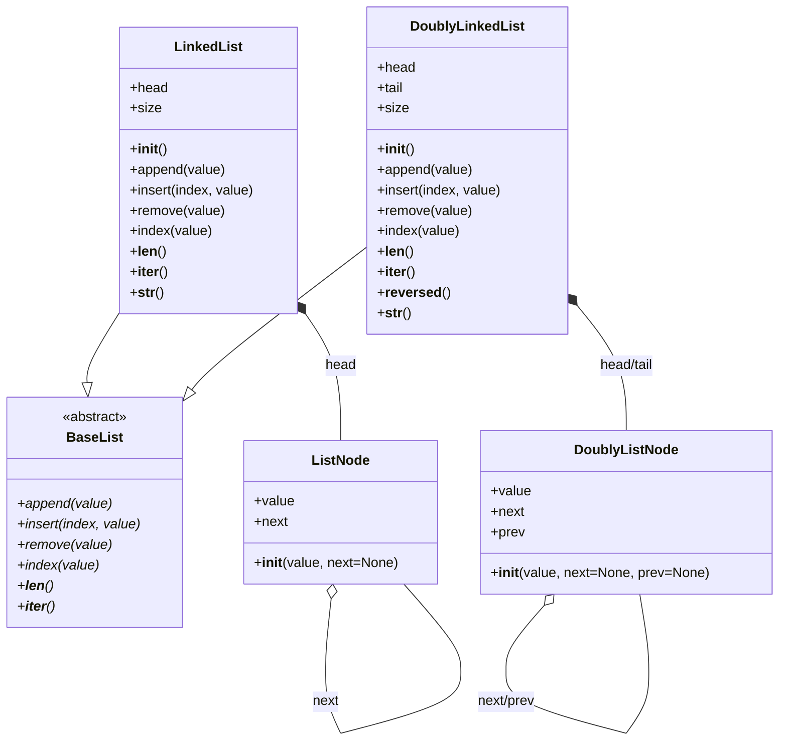

# Задание №2++ 
## Реализация структуры данных Двусвязный список

Для выполнения задания необходимо в файле `data_structures/lists/doubly_linked_list/doubly_linked_list.py` реализовать класс `DoublyLinkedList`, представляющий двусвязный список. Класс должен включать методы для добавления элементов, удаления элементов, поиска элементов и получения длины списка.  

## Примечания  
- Разработку вести в отдельной ветке, созданной на основе данной. В названии ветки префикс main заменить на название команды. 
- Корректность работы реализованных функций проверить запустив `test_runner.py` в корне проекта.
- Если зависимости проекта установлены, можно запустить:
    * автоматическую сортировку импортов в исходном коде `python -m isort .`
    * автоматическое форматирование исходного кода `python -m black .`
    * проверку синтаксиса и форматирования `python -m flake8 . --max-complexity=10 --max-line-length=88 --exclude .venv`.
  

## Двусвязный список (Doubly Linked List)  

**Двусвязный список** — это линейная структура данных, состоящая из узлов, где каждый узел хранит не только ссылку на следующий элемент, но и ссылку на предыдущий.  

### Отличия от односвязного списка:  
- Каждый узел содержит **две ссылки**: на следующий и на предыдущий элемент.  
- Позволяет эффективно перемещаться **в обе стороны** (вперёд и назад).  
- Упрощает операции удаления и вставки в середину списка, так как доступен предыдущий элемент.  
- Использует **больше памяти**, чем односвязный список, из-за хранения дополнительной ссылки.  

### Основные операции:  
1. **Добавление элемента** (в начало, конец или по индексу).  
2. **Удаление элемента** по значению или индексу.  
3. **Поиск элемента** по значению.  
4. **Получение длины списка**.  
5. **Итерация по элементам списка** (вперёд и назад).  

## Диаграмма классов  

### P.S.
Полезную информацию о порядке выполнения задания, установке и настройке необходимого ПО можно посмотреть в репозитории [docs](https://github.com/hse-algo-psapr-25/docs)