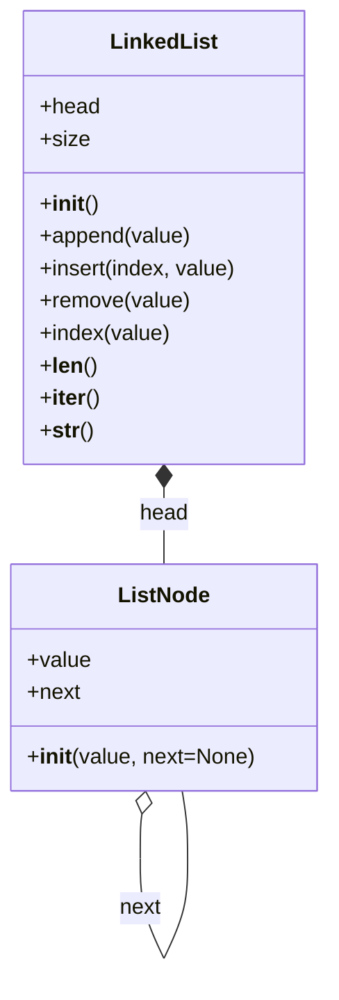

# Задание №2+ 
## Реализация структуры данных Связный список

Для выполнения задания необходимо в файле `data_structures/linked_list/linked_list.py` реализовать класс `LinkedList`, представляющий односвязный список. Класс должен включать методы для добавления элементов, удаления элементов, поиска элементов и получения длины списка.  

## Примечания  
- Разработку вести в отдельной ветке, созданной на основе данной. В названии ветки префикс main заменить на название команды. 
- Корректность работы реализованных функций проверить запустив `test_runner.py` в корне проекта.
- Если зависимости проекта установлены, можно запустить:
    * автоматическую сортировку импортов в исходном коде `python -m isort .`
    * автоматическое форматирование исходного кода `python -m black .`
    * проверку синтаксиса и форматирования `python -m flake8 . --max-complexity=10 --max-line-length=88 --exclude .venv`.
  

## Связный список (Linked List)  

**Связный список** — это линейная структура данных, состоящая из узлов, где каждый узел содержит данные и ссылку (указатель) на следующий узел в списке. Основное отличие связного списка от массива заключается в том, что элементы не располагаются в памяти последовательно, а связаны друг с другом ссылками.  

### Основные характеристики:  
- **Динамический размер** — память выделяется по мере добавления элементов.  
- **Эффективное добавление/удаление** элементов в начале списка или в середине (в отличие от массивов, где эти операции могут требовать сдвига элементов).  
- **Последовательный доступ** — доступ к элементам осуществляется путем последовательного прохода по узлам списка.  

### Основные операции:  
1. **Добавление элемента** (в начало, в конец или в определённую позицию).  
2. **Удаление элемента** по значению или индексу.  
3. **Поиск элемента** по значению.  
4. **Получение длины списка**.  
5. **Итерация по элементам списка**.  

## Диаграмма классов  

### P.S.
Полезную информацию о порядке выполнения задания, установке и настройке необходимого ПО можно посмотреть в репозитории [docs](https://github.com/hse-algo-psapr-25/docs)