```mermaid
gantt
    title Диаграмма Ганта - Ленточная стратегия для 5 исполнителей
    dateFormat  HH:mm    
    axisFormat %H:%M
    Начало выполнения работ : milestone, m1, 00:00, 0h
    section Исполнитель 1
    Задача A         :a1, 00:00, 3h
    Задача B         :a2, after a1, 4h
    Задача C         :a3, after a2, 6h
    Задача D         :after a3, 4h
    section Исполнитель 2
    Задача D         :b1, 00:00, 3h
    Задача E         :b2, after b1, 7h
    Задача F         :after b2, 7h
    section Исполнитель 3
    Задача F         :c1, 00:00, 2h
    Задача G         :c2, after c1, 10h
    Задача H         :after c2, 5h
    section Исполнитель 4
    Задача H         :d1, 00:00, 7h
    Задача I         :after d1, 10h
    section Исполнитель 5
    Задача I         :00:00, 7h
    Окончание выполнения работ : milestone, m2, 17:00, 0h
```

# Задание 9. Варианты 1-4
# Оптимальное расписание. Ленточная стратегия
## Задачи  
1. Ленточная стратегия - в файле schedules/schedule.py реализовать два приватных метода класса Schedule.
    - __calculate_duration(self) -> float: Вычисляет и возвращает минимальную продолжительность расписания.
    - __fill_schedule_for_each_executor(self) -> None: Процедура составляет расписание из элементов ScheduleItem для каждого исполнителя, на основе исходного списка задач и общей продолжительности расписания.
2. Отдельные задачи для вариантов:
    - Вариант 1. Разработать диаграмму классов пакета schedule_pack с использованием библиотеки (mermaid-js)[https://github.com/mermaid-js/mermaid#class-diagram-docs---live-editor]
    - Вариант 2. Реализовать вывод полученного от класса Schedule расписания в формате диаграммы Ганта библиотеки (mermaid-js)[https://github.com/mermaid-js/mermaid#gantt-chart-docs---live-editor]
    - Вариант 3. Добавить новые методы для класса Schedule, для вывода времени простоя для каждого исполнителя и общего времени простоя для всего расписания.
    - Вариант 4. Добавить метод для класса Schedule, для изменения состава задач и перерасчета расписания.

## Примечания 
- **В файле main.py представлен только пример использования пакета schedules, задание необходимо выполнять в файле schedules/schedule.py**.
- Для решения задачи составления оптимального расписания подготовлен python-пакет schedules.
- Python-пакет schedules реализован в объектно-ориентированной парадигме.
- Обратить внимание, что некоторые тесты ожидают вызов определенного вида исключения с заданным сообщением об ошибке.
- В пакете представлены следующие классы
    * Task: Представляет задачу для составления расписания. Используется в качестве входных данных для класса Schedule.
    * Schedule: Представляет оптимальное расписание для списка задач и количества исполнителей. Для каждого исполнителя расписание представлено набором экземпляров класса ScheduleItem.
    * ScheduleItem: Представляет собой элемент расписания, включает в себя задачу, выполняющуюся в течение некоторого времени, с указанием моментов начала и окончания ее выполнения.
- Проверить реализацию класса Schedule можно запустив набор авто-тестов в файле schedules/tests/test_schedule.py.
- Запустить тесты для проверки всего пакета schedules можно с помощью файла test_runner.py.

## Ленточная стратегия
### Постановка задачи:  
1. Количество заданий произвольно;  
2. Каждое задание имеет собственную длительность;  
3. Задания независимы - несколько заданий может выполняться разными исполнителями одновременно, но в каждый момент времени одно задание должно выполняться только одним исполнителем;  
4. Разрешены прерывания при выполнении заданий - задание прерванное одним исполнителем может быть продолжено другим;  
5. Количество исполнителей произвольно, но не меняется в ходе выполнения заданий;  
6. Исполнители универсальны, то есть могут выполнять любые задания;  
7. Требуется построить расписание выполнения всех заданий в кратчайшие сроки.

### Алгоритм:
1. Необходимо выбрать наибольшую длительность Tmax среди заданий.    

$$  
T_{max} = max\{t_1, t_2, ..., t_n\}  
$$  

где tn - задание с номером n.  
2. Необходимо рассчитать среднюю продолжительность заданий для одного исполнителя Tavg, то есть разделить сумму продолжительностей заданий на количество исполнителей.    

$$  
T_{avg} = \frac {\sum_{i=1}^n  t_i}{k}  
$$  

где k - количество исполнителей.  
3. Длительность оптимального расписания Topt определяется как максимум из рассчитанных ранее средней продолжительности для исполнителя и наибольшей длительности заданий.  

$$  
T_{opt} = max\{T_{max} , T_{avg}\}  
$$  

4. Задания в исходном порядке разрезаются на "ленты" длиной Topt, которые распределяются по исполнителям, при этом "разрез ленты" может производиться внутри задания, что означает прерывание данного задания. Ленты могут представляться в виде диаграммы Ганта.

