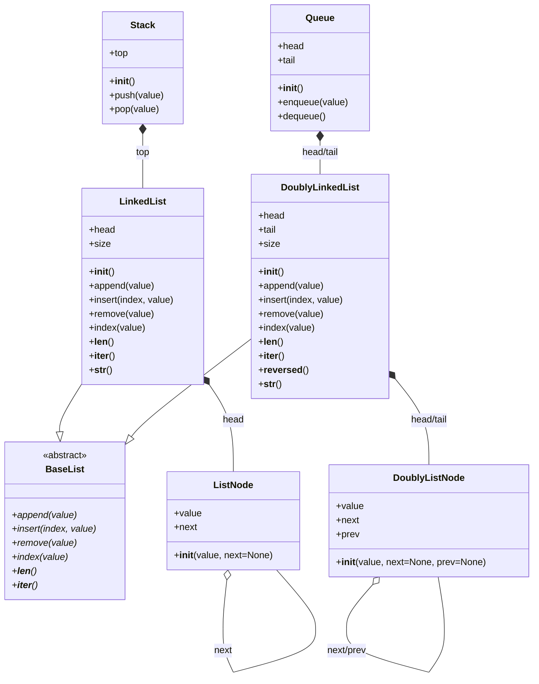

# Задание №3+
## Исследование: Стэк и Очередь на основе списков  

В этом задании необходимо проанализировать, как можно реализовать структуры данных **Стэк (Stack)** и **Очередь (Queue)**, используя уже реализованные структуры — `LinkedList` и `DoublyLinkedList`.  

Реализованные структуры данных собраны в ветке https://github.com/hse-algo-psapr-25/code-tasks/tree/main-work, в файле README.md представлено описание структур данных и диаграмма классов.

### Определения:  
Стэк - структура данных, представляющая собой связный список, запись и чтение элементов в котором производится только с начала. Метод доступа к элементам - LIFO (Last Input - First Output, "последним вошел, первым вышел")
Очередь - структура данных, представляющая собой связный список, запись в который производится с конца, а чтение с начала. Метод доступа к элементам - LIFO (First Input - First Output, "первым вошел, первым вышел")
### Задание:  
1. Ответить на вопросы:  
   - На каком списке удобнее реализовать **стэк** и почему?  
   Стэк удобнее реализовать на структуре `LinkedList`, потому что для чтения и записи необходима только вершина списка. Не требуется осуществлять просмотр элементов, удаление и вставку элементов в середину или конец. При добавлении нового элемента мы в нем устанавливаем ссылку на первый элемент существующего списка, вершиной списка (`head`) становится новый элемент. При чтении элемента мы берем текущую вершину и новой вершиной списка становится следующий эелемент.
   - На каком списке удобнее реализовать **очередь** и почему?  
   Очередь удобнее реализовать на структуре `DoublyLinkedList`, потому что записывать мы будем в хвост (`tail`), а считывать будем с вершины (`head`).
   - Какие операции из интерфейсов `LinkedList` и `DoublyLinkedList` можно использовать напрямую?  
   Из интерфейса `LinkedList` для стэка можно напрямую использовать операции `__init__`, insert, которому можно передать вершину стэка и индекс 0, и remove также с индексом 0.
   Из интерфейса `DoublyLinkedList` для очереди можно напрямую использовать операции `__init__`, а также `append`  для добавления элементов в конец и `popleft` для чтения первого элемента и его удаления. 
   - Какие дополнительные методы или изменения интерфейсов списка могут упростить реализацию?  
   Для стэка можно изменить следующие методы интерфейса `LinkedList`:
   Для вставки: insert - меняем на push, оставляем только случай для index == 0, параметр index не передаем;
   Для удаления: remove - меняем на pop, оставляем только случай для self.head.value == value, параметр value не передаем.
   Для очереди можно использовать методы интерфейса `DoublyLinkedList` `append` и `popleft` напрямую.
   

2. Подумать над соответствием операций:  
   - **Стэк (LIFO):**  
     - `push` — добавление элемента  
      Вызывает метод insert списка с индексом 0.
     - `pop` — удаление последнего добавленного элемента
      Операцию remove нужно модифицировать, чтобы удалять только первый элемент
   - **Очередь (FIFO):**  
     - `enqueue` — добавление элемента в конец  
      Метод `append`
     - `dequeue` — удаление элемента из начала  
      Метод `popleft`

3. Изобразить предлагаемое решение в виде **диаграммы классов** (например, с использованием Mermaid), показав:  
   - какие классы будут использоваться, и как они будут изменены,  
   - какие новые классы (Stack, Queue) вы планируете добавить,  
   - от каких существующих классов они будут зависеть (агрегация/композиция).  

### Примечания  
- Реализовывать сами классы **Stack** и **Queue** в этом задании **не требуется**.  
- Основная цель задания — научиться видеть, как новые структуры можно построить на базе уже реализованных.  